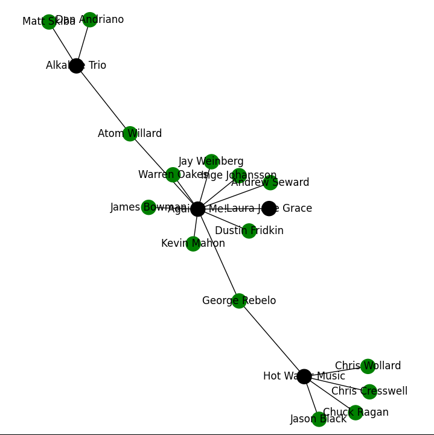
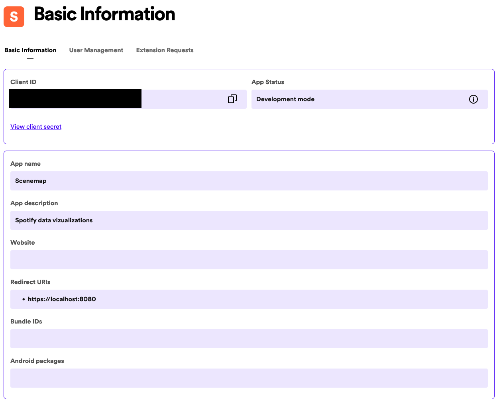

# scenemap
Nerdy data vizualizations for your Spotify library

I started this project after becoming sort of fascinated at the breadth of
musical influence specifically of some involved in metalcore scene at the turn of
the millenium, and then a broader question of just how incestuous my musical
family tree was. There is a tremendous diversity of musical data that have really just
begun to be examined on Wikipedia, just waiting to be scraped. I pick at this 
project when I have time and inclination. Eventually it will be implemented as a
flashy [Dash](https://dash.plotly.com) app and have an increasingly quantitative
focus, but for now it exists as a proof of concept and isn't really guaranteed to
work well.



How to try it:
- Grab an api key from developer.spotify.com--you might also need to create an app (see below)



- Make sure you have python and run the following commands somewhere:
  - `git clone https://github.com/nekoju/scenemap.git`
  - `cd Scenemap`
- Paste in `<some-directory>/Scenemap/scenemap/.env` like so:
```
#!/usr/bin/env python3

client_secret = "YOURSECERT"
client_id = "YOURID"
redirect_uri = "https://localhost:8080"
```
- Run `python3 scenemap/spotify.py` and paste in the redirect when prompted
- The software will do its thing then present you with a breakpoint, at which
  point you can run `plt.show()` to look at the graph and use the buttons on the
  toolbar to zoom around. This is very early and nothing is guaranteed to work! Have fun!

